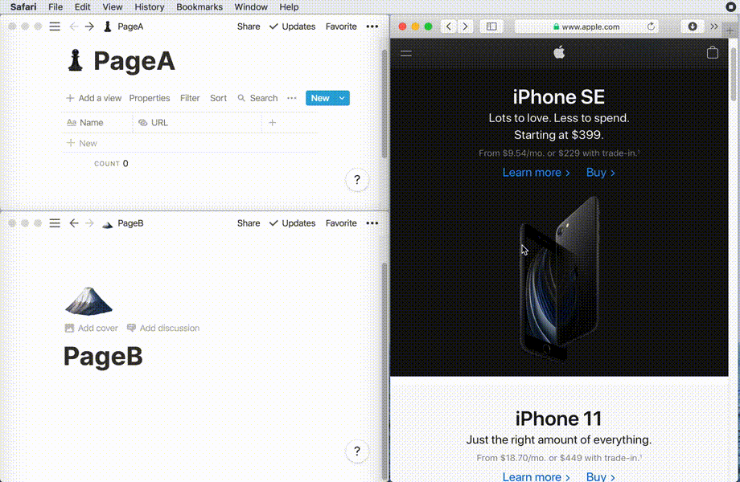
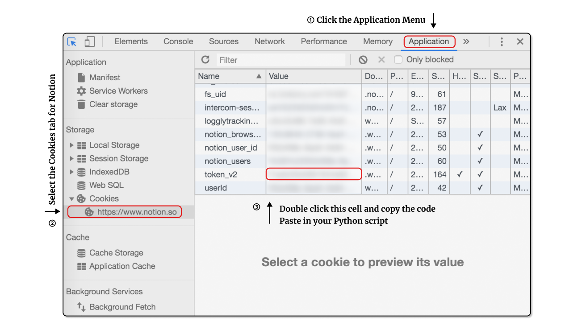
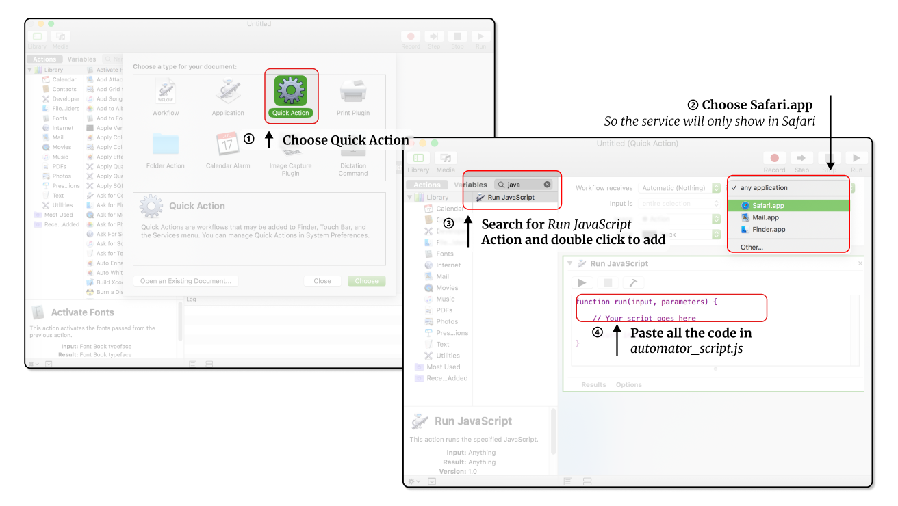
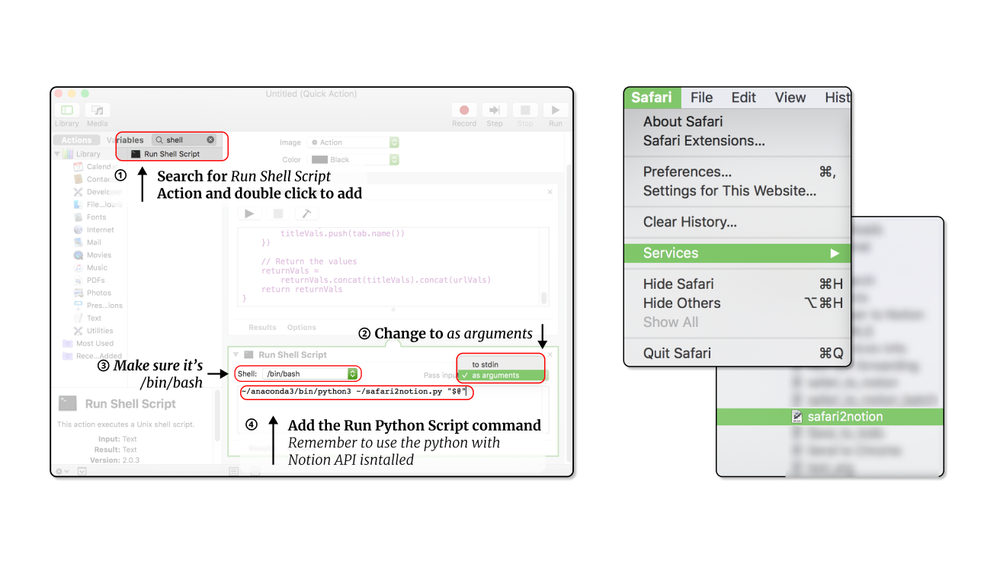
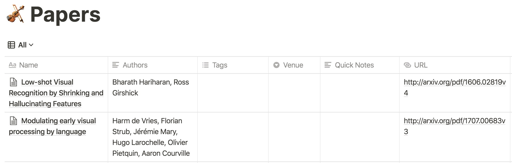

# Notion Safari Extension
Build your own Notion Safari Extension and make it even better!



## Installation
1. Install the necessary python packages
    ```
    pip install -r requirements.txt
    ```
2. Create your own notion configuration file:
    
    1. Fetch the Notion token from your browser. Firstly log into your Notion account in Chrome. On [your Notion page](Notion.so), open the inspector panel using Command+Shift+C, follow the instructions shown in the figure below.
        

    2. Fill in the token and page name/link in the notion configuration file based on the [template](https://github.com/lolipopshock/notion-safari-extension/blob/master/notion-config-example.json). 
        - For `<page-link>`, it's link to the given Notion page, e.g., https://www.notion.so/xxx/xxxx. It can be a regular page or database.
        - For `<page-name>`, it doesn't need to the same as the page name in Notion. 

3. Add the **absolute path** of the notion configuration file to the `automator_script.js` (line 11) and `safari2notion.py` (line 17) file. 

4. Open the `automator` App on your Mac and create a new file (Command + N). Follow the instruction shown below to create a mac `Quick Action` and add the `automator_script.js` code to it. 
    
    Note: The `automator_script.js` only saves the current tab, while the `automator_script_batch.js` saves all the tabs in the front window. You can choose the script to paste based on your need, but please remember to change the path to notion configuration in the file. 

5. Bind the automation with the python script `safari2notion.py` using the code `/path/to/your/python ~/path/to/safari2notion.py "$@"`, and save the automation as `safari2notion`. Then you can find it in the Service menu in Safari. 
    

Congratulations! You've finished the configuration. You can further customize the code by modifying the `lib/processor.py` and `safari2notion.py` to your demand. 

## Showcase 

### Build an Arxiv paper information parser 

The functionality in `lib/processor.Paper` supports automatic parsing of arxiv links. You can easily use that to generate and store a paper's meta information based on its arxiv paper link. 

1. Creating a Notion page as database, and add the `Authors` and `URL` column (case sensitive). 
2. Add the page-link and and name `Paper` to the `"pages"` object in your notion configuration file:
    ```
    "pages": {
        "Paper": "https://notion.so/xxx/xxxx"
    }
    ```
3. On an arxiv page, click the `safari2notion` service to add the paper to your Notion page. 
    

## Read More

- [Powerup your Notion Safari Extension](https://www.szj.io/tech/2020/05/04/powerup-safari-notion-extension.html)
- [Build Your Own Notion Safari Extension](https://www.szj.io/tech/2020/04/26/safari-notion-automator.html)

## Reference 

- [Notion-py:Unofficial Python API client for Notion.so](https://github.com/jamalex/notion-py)
- [md2notion: A better Notion.so Markdown importer](https://github.com/Cobertos/md2notion)
- [Newspaper3k: Article scraping & curation](https://github.com/codelucas/newspaper#newspaper3k-article-scraping--curation)
- [arxiv.py: Python wrapper for the arXiv API](https://github.com/lukasschwab/arxiv.py)